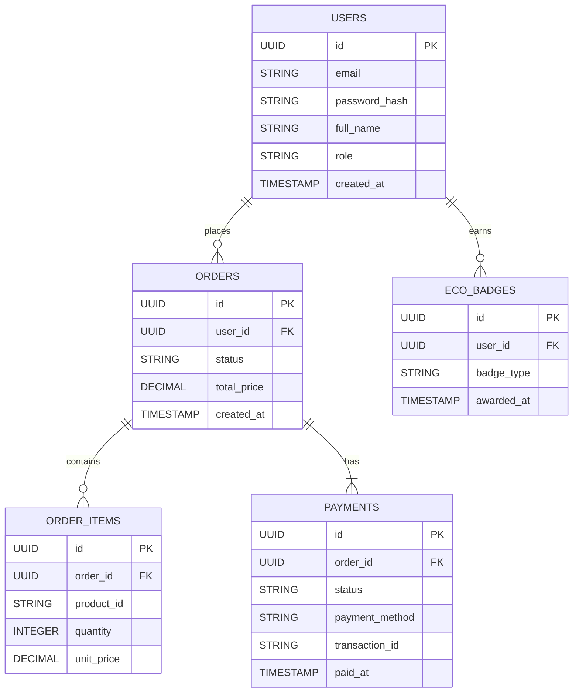

# 📊 Entity Relationship Diagram (ERD)

This document outlines the database design for the EcoMerce.


## 🏛 PostgreSQL (Relational Data)



### Notes

- `USERS.role` → enum: customer, admin  
- `ORDERS.status` → enum: pending, paid, shipped, canceled  
- `PAYMENTS.status` → enum: pending, success, failed  
- `ORDER_ITEMS.product_id` → refers to MongoDB product ID  
- Foreign keys:
    - `ORDERS.user_id` → USERS.id
    - `ORDER_ITEMS.order_id` → ORDERS.id
    - `PAYMENTS.order_id` → ORDERS.id
    - `ECO_BADGES.user_id` → USERS.id


## 🍃 MongoDB (Product Catalog)
Example document structure:

```json
{
  "_id": "ObjectId",
  "name": "Eco Tote Bag",
  "description": "Made from 100% recycled cotton.",
  "price": 19.99,
  "stock": 120,
  "eco_tags": ["recycled", "zero-waste", "local"],
  "supplier": {
    "name": "GreenMakers Co.",
    "country": "Thailand",
    "certifications": ["Fair Trade", "Organic Cotton"]
  },
  "created_at": "ISODate",
  "images": ["https://..."],
  "rating": 4.8
}
```